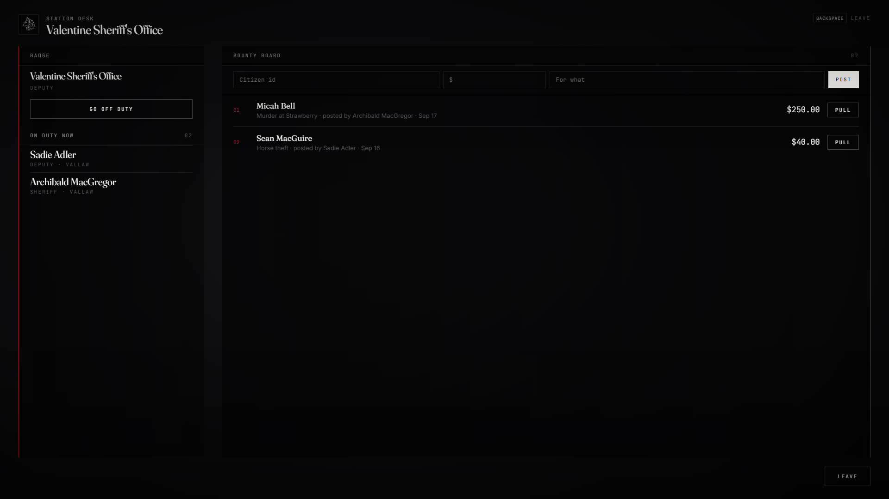

# lxr-lawman — The law of every town, for LXRCore

Any job of type `leo` or `federal` in the core registry is the law here —
sheriffs, marshals, the city police, the federal agencies, the prison guard.
Duty at the station desk, cuffs and escort, search and seizure into the
evidence locker, fines that land in the society book, sentences on Sisika
that count down, and a bounty board that pays whoever brings the name in.
Every power is an lxr-interact option; every decision is the server's.



## What it does

* **Duty** — at the desk (`/desk` page: badge, duty toggle, who is on duty,
  the bounty board). Off duty, the options disappear.
* **On people** — Cuff / Uncuff (needs `handcuffs`), Escort, Search (the
  inventory's search view), Seize contraband (every `legal = false` item into
  the station's evidence stash; guns leave the hands through lxr-weapons),
  Fine (amount + reason, `Config.Fines`, paid into `society_<job>` via
  lxr-bank), Send to Sisika (minutes + reason), Release.
* **Cuffed** — animation, attack / aim / jump / sprint / weapon wheel
  blocked, state bag `cuffed`; survives a relog through core metadata.
* **Jail** — teleported to the yard, walked back if they stray, sentence
  counts down while online (`lxr:lawman:jail:tick` for a work loop),
  released at the gate.
* **Bounties** — posted by the law, paid on jailing; bounty hunters read the
  board and turn a cuffed name in at any desk.
* **Armoury / evidence** — lxr-inventory stashes per job and per station;
  the armoury needs the grade permission `armory`.
* **Backup** — `/backup` raises a `10-78` through lxr-dispatch.
* **Events** — `lxr:lawman:cuffed / searched / seized / fined / jailed /
  released / bounty:posted / bounty:paid`.

## Install

```cfg
ensure lxr-core
ensure lxr-nui
ensure lxr-inventory
ensure lxr-interact
ensure lxr-lawman
```

`lxr_bounties` is created by the core's migration runner. lxr-weapons,
lxr-bank and lxr-dispatch are used when running.

## Configuration

`config.lua` — `Config.Lang`, `Config.Law`, `Config.Stations`,
`Config.Stash`, `Config.Cuffs`, `Config.Fines`, `Config.Jail`,
`Config.Bounties`, `Config.Security`.

## API

| Name | Side | Purpose |
|---|---|---|
| `IsLaw(src)` · `Cuff(src, on)` · `Jail(src, minutes, reason)` · `Release(src)` | server | other resources' hooks |
| `Board()` · `PostBounty(citizenid, amount, reason, by)` | server | the board |
| `Player(src).state.cuffed / jailed` | both | replicated state |
| `IsCuffed()` · `JailLeft()` · `IsLaw()` | client | local mirror |

## Licence

© 2026 iBoss21 / LXRCore — All Rights Reserved. See `LICENSE`.
